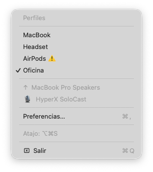
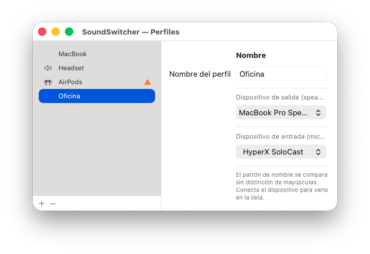

# SoundSwitcher

> Switch your entire audio setup — speaker and microphone — with a single keystroke.

   

## Screenshots

 

---

## The problem it solves

If you work across different setups during the day — switching from headphones to a desk microphone, jumping on a call, moving between apps that behave differently with audio — you know the pain: each switch means opening System Settings, changing the output device, then the input device, clicking around menus, sometimes doing it twice because the system didn't register it.

SoundSwitcher collapses all of that into **one keyboard shortcut**.

You define profiles (e.g. *MacBook*, *Headset*, *Office mic + laptop speakers*, *AirPods*), and then pressing **⌥⌘S** rotates through them in order, applying both the output and input device at once. A small banner confirms what switched. That's it.

---

## Features

- **⌥⌘S** — cycle through your audio profiles instantly
- **Profiles** — each profile sets both the output device (speaker) and input device (microphone) together
- **Menu bar icon** — always visible, shows the active profile name on hover
- **Preferences panel** — native macOS UI to create, reorder, and configure profiles
- **Smart fallback** — if a device in a profile isn't connected, the current device is kept and the banner tells you
- **Notification banner** — appears for 2.5 seconds after each switch, showing the active devices

---

## Installation

### Option A: Download (recommended)

1. Download `SoundSwitcher-x.x.x-arm64.zip` from the [latest release](../../releases/latest)
2. Unzip and drag `SoundSwitcher.app` to your `/Applications` folder
3. Open it — if macOS shows a security warning, go to **System Settings → Privacy & Security** and click **Open Anyway**
4. The SoundSwitcher icon appears in your menu bar

> **Requires:** macOS 13 Ventura or later · Apple Silicon (M1 and later)

### Option B: Build from source

**Requirements:** Xcode Command Line Tools (`xcode-select --install`)

```bash
git clone https://github.com/augustose/SoundSwitcher.git
cd SoundSwitcher
make install   # builds, bundles, and copies to /Applications
```

---

## Usage

### Switching profiles

Press **⌥⌘S** (Option + Command + S) to cycle to the next available profile. A banner appears near the top of the screen confirming which output and input devices are now active.

Profiles with unavailable devices (e.g. AirPods not connected) are skipped automatically.

### Menu bar

Click the SoundSwitcher icon to:
- See all profiles (✓ marks the active one, ⚠️ marks unavailable)
- Select any profile directly
- Open **Preferences** (⌘,)

### Configuring profiles

Open **Preferences** from the menu. Each profile has a name, an output device, and an input device. Device names are matched as case-insensitive substrings, so "hyperx" matches "HyperX SoloCast".

**Example setup:**

| Profile | Output | Input |
|---------|--------|-------|
| MacBook | MacBook Pro Speakers | MacBook Pro Microphone |
| Headset | Plantronics BT600 | Plantronics BT600 |
| Office | MacBook Pro Speakers | HyperX SoloCast |
| AirPods | AirPods Pro | AirPods Pro |

---

## Auto-launch at login

**System Settings → General → Login Items** → add `SoundSwitcher.app`.

---

## Building a release

```bash
git tag v1.x.x
make release   # produces SoundSwitcher-v1.x.x-arm64.zip
# Upload the .zip to a new GitHub Release
```

---

## License

MIT
